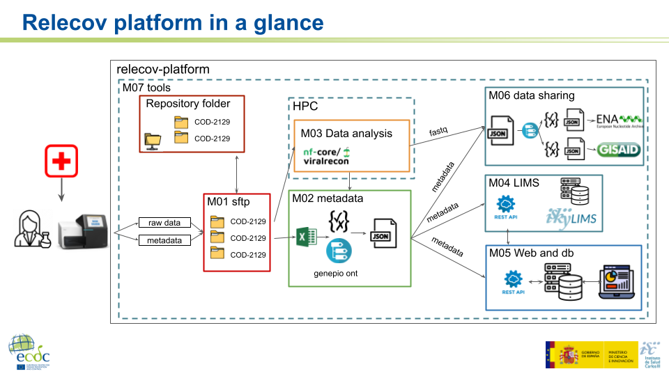

# Description

## Relecov: Spanish Network for Genomic Surveillance of SARS-CoV-2
The replication process of the SARS-CoV-2 virus, like the rest of the viruses, implies changes in its genome through mutations. Thanks to genomic sequencing, it has been possible to observe the evolutionary adaptation and diversification of the SARS-CoV-2 virus at a global level throughout the pandemic.Surveillance of these changes has made it possible to monitor the appearance and impact of these changes, especially those that could be associated with an increase in severity or lethality, which escape the effect of neutralizing antibodies generated after a previous infection or after infection. vaccination, that cannot be detected by any of the diagnostic methods or that are resistant to the action of possible treatments. The appearance of variants with some of these changes could have important epidemiological consequences, constituting a public health problem.For this reason, on January 19, the European Commission published a statement urging countries to increase the sequencing rate by requesting the sequencing of at least 5%, and preferably 10%, of the positive results of the COVID-19 tests. , minimize delays in results and ensure that this data is shared, so that comparisons can be made. As a result of this request, the Genomic Sequencing Laboratory Network (RELECOV) was born.RELECOV aims to cover the sequencing needs of SARS-CoV-2 at the national level.

Inmaculada Casas. Head of Respiratory and Influenza Unit, WHO National Influenza Center-Madrid
This network, coordinated by the Reference Laboratory for Respiratory Viruses of the National Microbiology Center (Carlos III Health Institute), is in turn responsible for reporting cases to the ECDC and the WHO.The participants in the network have been appointed by the different Autonomous Communities, all of them and the two autonomous cities being represented. The participation modality is different according to the decision of each autonomous community, being able to form part of the network of more than one laboratory or sequencing consortia.The early generation of sequences and the pooling of the sequences obtained are key tools in virus surveillance and in preparing for future public health alerts.

More info [here](http://relecov.isciiides.es/news-reports/)

## Platform Overview
RELECOV plaform consits in different elements that work together to gather, store and share SARS-CoV-2 genomic data. The platform receives fastq files along with its metadata which is processed in several steps. This steps include:

1. Metadata validation and upload to a common database
2. Standarized bioinformatic analysis of raw data
3. Bioinformatics metadata validation and upload to database
4. Data sharing with public databases
5. Data visualization and analysis.
6. Controlled access to data following FAIR principles.

The platform works with two main software developments: Relecov platform website and database and a package of helper tools called relecov-tools.

## Relecov Platform website
The website stores all the processed data and metadata, and allows the visualization of several metrics and statics including a nextstrain national installation. Moreover it includes a intranet that allows the follow up of the samples from each lab and a REST API which allows controlled data access by all the network members.

## Relecov-tools
relecov tools is a python package with helper functions for data management in the project. Read more [here](../relecov_tools.md)

